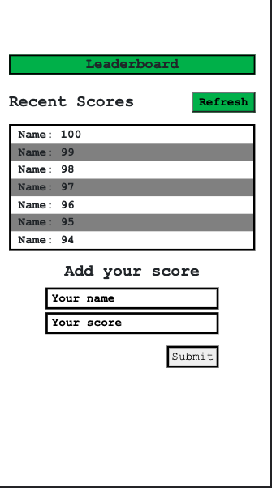
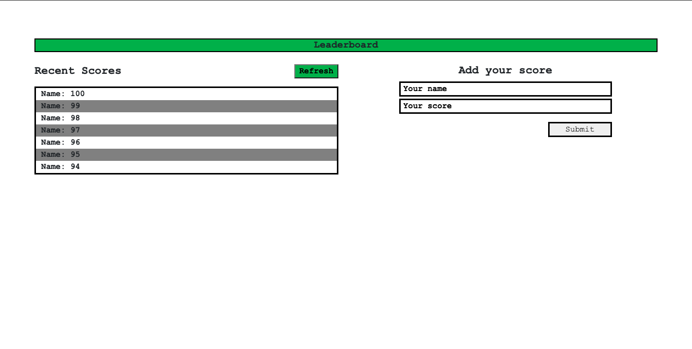

# LEADERBOARD WEB APP

> A Wep App that displays scores from an API and scores added by a User,




- A User can add scores to the API.
- A User can pull scores from the API using the ```Refresh``` button.

## Built With

- HTML, CSS, Javascript

<!-- ## Live Demo

[Live Demo Link](https://livedemo.com) -->

# Set Up
## Clone This Repository
```
$ git clone https://github.com/emmyobonyo/leaderboard.git
$ cd leaderboard
```

## Run Project
```$ npm install
$ git checkout feature/setup-project
$ npm run start
```

## Open page in browser
```
open dist/index.html
```

## Authors

👤 **Emmanuel Obonyo**

- GitHub: [@emmyobonyo](https://github.com/emmyobonyp)
- Twitter: [@temmyobonyo](https://twitter.com/emmyobonyo)
- LinkedIn: [Emmanuel Obonyo](https://https://www.linkedin.com/in/emmanuel-obonyo-3728a2200/)

<!-- ## 🤝 Contributing

Contributions, issues, and feature requests are welcome!

Feel free to check the [issues page](../../issues/). -->

## Show your support

Give a ⭐️ if you like this project!

<!-- ## Acknowledgments

- Hat tip to anyone whose code was used
- Inspiration
- etc -->

## 📝 License

This project is [MIT](./MIT.md) licensed.
